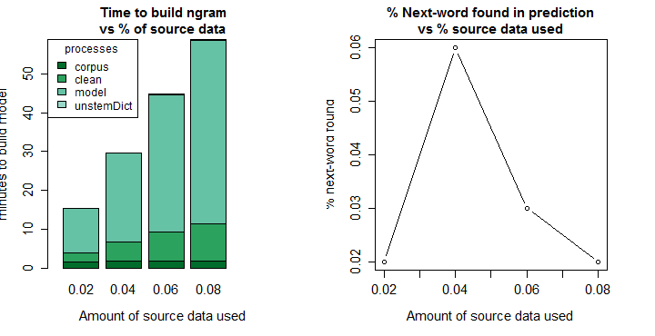
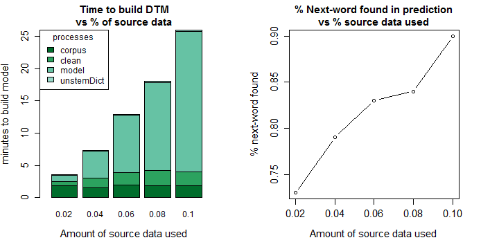

Data Science Capstone
========================================================

<h2>Swiftkey Project</h2>
<h2>Final Report</h2>
 

author: Greg Watson

date: 2015-08-25

Why this project? Why now?
========================================================
<b>GOAL-</b> Build a model with which to predict the next word typed using the source data provided (<a href="https://d396qusza40orc.cloudfront.net/dsscapstone/dataset">click here for data</a>)

<b>PURPOSE -</b> Confirm (to myself) that the R text-mining capability will scale and provide the text mining analysis I require for my day-to-day work

<b>Method...</b>
- Develop two models, one based on bigram + trigram + quatrgram + backoff, one based on document-term-matrix (DTM)
- Measure the time R takes to build each model under volumes of source data ranging from 2% to 10% of the data provided
- Test model effectiveness for predicting the next word
- Demo the models with a Shiny app

<b>Why now?</b> I am starting a new job and will need this capability

Discription of Algorithms
========================================================

<b>N-Gram</b> - An ngram is a group of n words that appear together, after the text has been cleaned (stop words, profanity, and any characters that are not letters removed, remaining words stemmed). The first (n - 1) words constitute the lookup key, the nth word is the prediction. Ngrams are sorted in descending order by frequency of occurence. The model returns the 5 most frequent.

<b>Backoff</b> - Apply the last three words in a Quatrgram, then two words in a trigram, then one word in a bigram, until the model has found a total of five predictions.

<b>Document-Term-Matrix (DTM)</b> - List each term as the column and row names of a matrix; the cells contain the frequency with which the terms occur together in the same document. The model has two steps: (1) Determine the most probable category for the words you typed. (2) Lookup the words in the DTM that most often occur with the last word typed

<b>Test for Accuracy</b> - I partitioned 5% of the data from the selected input data. This 'test' partition was NOT used to develop the ngram or DTM models. In the test, I used the 1st, 2nd, and 3rd words from each line (after cleaning) as the lookup key, and checked to see if the 4th word from the test line appeared in the array of words returned by each model.

N-Gram results
========================================================
The graphs show that processing time increased in line with data volume (4 times the volume of data, took a little less than 4 times as long), but the accuracy of prediction never exceeded 5%. 

<b>Conclusion</b>: Ngrams help to understand a data set and ngram processing does scale. However, the results are poor predictors of the next word.

DTM results
========================================================
Processing time increased 5 fold as data volume increased 5 fold, but from a lower starting point than for the NGRam model. The prediction dataset included the test word 75% to 90% of the time.

<b>Caution</b> - The prediction dataset for DTM is much larger than the dataset for the NGram model. 

<b>Conclusion</b> - The DTM model would process all of the supplied data if run over a weekend, and will serve as a base for further analysis such as cluster and sentiment

Shiny Apps
========================================================

You can try the NGram and DTM models yourself using the two shiny apps listed here.

App Function: These apps <u>test</u> the algorithms; enter some words and it predicts the next-word

For example:

You Type...                   | The app suggests...
------------------------------|--------------------
merry christmas and happy new | year
happy                         | birthday
Instructions: Click one of the links below and follow the instructions on the web page.

<a href="https://gregbwatson.shinyapps.io/skCapstoneShiny">DTM Shiny App</a> 
<a href="https://gregbwatson.shinyapps.io/skShiny_NGRAM">NGram Shiny App</a>

<b>Conclusion</b>
I am impressed by what R is able to accomplish on a laptop and believe it will perform the tasks that inspired me to complete the data science certificate.

